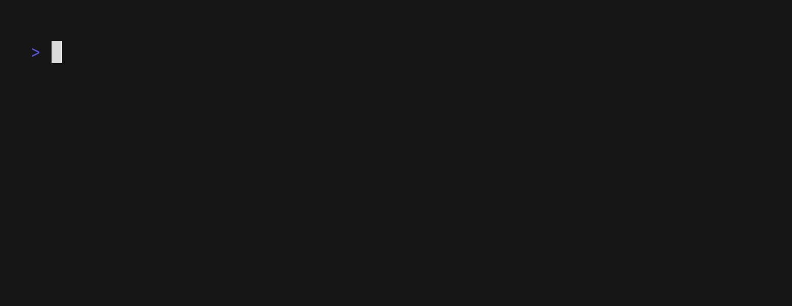
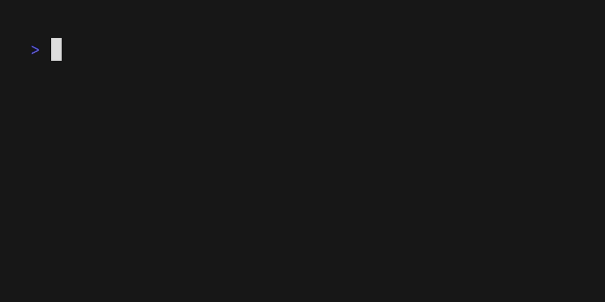
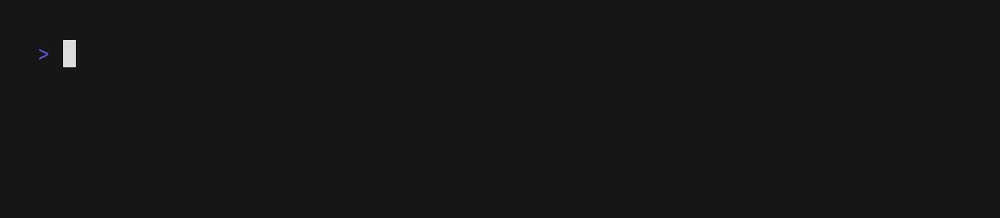
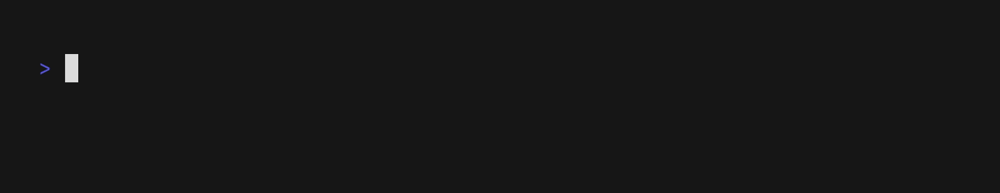
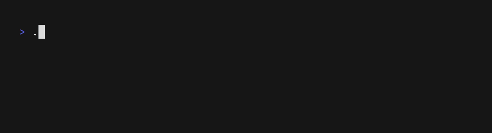
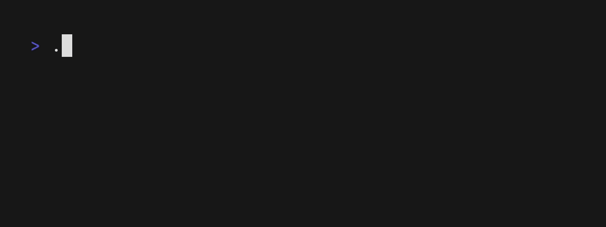
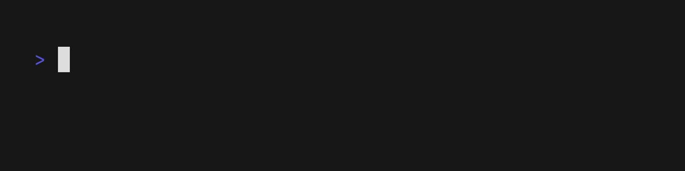

  <h1 align="center"><b>promptkit</b></h1>
  
<i>Interactive command line prompts with style!</i>

  

    
    
    
     
    
    
  

Promptkit is a collection of common command line prompts for interactive
programs. Each prompts comes with sensible defaults, re-mappable key bindings
and many opportunities for heavy customization.

---

**Disclaimers:**

- The API of library is not yet stable. Expect significant changes in minor
  versions before `v1.0.0`.

---

## Selection

Selection with filter and pagination support: [Example Code](https://github.com/erikgeiser/promptkit/blob/main/examples/selection/main.go)

---

The selection prompt is highly customizable and also works well with custom
types which for example enables filtering only on custom fields: [Example Code](https://github.com/erikgeiser/promptkit/blob/main/examples/selection_custom/main.go)

The selection module also contains a multi-selection prompt (this is still a preview, use `go get go get github.com/erikgeiser/promptkit@main`): [Example Code](https://github.com/erikgeiser/promptkit/blob/main/examples/multi_selection/main.go)

The selection module also contains a multi-selection prompt (this is still a preview, use `go get go get github.com/erikgeiser/promptkit@main`): [Example Code](https://github.com/erikgeiser/promptkit/blob/main/examples/multi_selection_custom/main.go)

---

## Text Input

A text input that supports editable default values: [Example Code](https://github.com/erikgeiser/promptkit/blob/main/examples/textinput/main.go)

---

Custom validation is also supported: [Example Code](https://github.com/erikgeiser/promptkit/blob/main/examples/textinput_custom/main.go)

---

The text input can also be used in hidden mode for password prompts: [Example Code](https://github.com/erikgeiser/promptkit/blob/main/examples/textinput_hidden/main.go)

The text input prompt also supports auto-completion: [Example Code](https://github.com/erikgeiser/promptkit/blob/main/examples/textinput_completion/main.go)

For longer inputs, there is also a textara (this is still a preview, use `go get go get github.com/erikgeiser/promptkit@main`): [Example Code](https://github.com/erikgeiser/promptkit/blob/main/examples/textarea/main.go)

It can also be customized (this is still a preview, use `go get go get github.com/erikgeiser/promptkit@main`): [Example Code](https://github.com/erikgeiser/promptkit/blob/main/examples/textarea_custom/main.go)

---

## Confirmation Prompt

A confirmation prompt for binary questions: [Example Code](https://github.com/erikgeiser/promptkit/blob/main/examples/confirmation/main.go)

The confirmation prompt can be customized as well: [Example Code](https://github.com/erikgeiser/promptkit/blob/main/examples/confirmation_custom/main.go):

## Widget

The prompts in this library can also be used as [bubbletea](https://github.com/charmbracelet/bubbletea) widgets: [Example Code](https://github.com/erikgeiser/promptkit/blob/main/examples/bubbletea_widget/main.go)

## Acknowledgements

This library is built on top of many great libraries, especially the following:

- https://github.com/charmbracelet/bubbletea
- https://github.com/charmbracelet/bubbles
- https://github.com/muesli/termenv
- https://github.com/muesli/reflow
